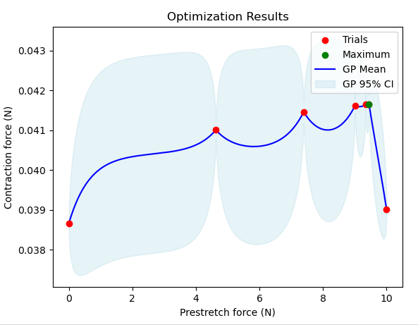
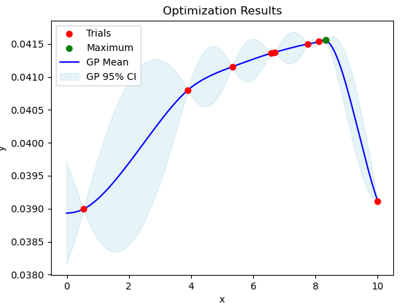

## Options for Bayesian Optimization
Bayesian Optimization can optimize very diverse functions depending on its parameters. These parameters can be adjusted in the file ```setup_BayesOpt_general_1D.py```. 

- The options for the kernel are the RBF-kernel and the Matérn kernel with $\nu\in${0.5, 1.5, 2.5}.
- The possible mean functions are the constant mean and the zero mean.
- The noise can be set to constant or variable.
- The implemented acquisition functions are the Expected Improvement (EI), Probability of Improvement (PI), Knowledge Gradient (KG) and Entropy Search (ES).
- The rest are minor changes like the stopping criterion or the initial values.

## General recommendation
The optimal parameter setup is different for every case, and it is difficult to provide a general recommendation. 
A tentative recommendation is provided in  Lukas Bauer's bachelor thesis (see [tag](https://github.com/opendihu/optimization/releases/tag/Bachelor-thesis)): Matérn kernel with $\nu$=0.5, the constant mean function, fixed noise, the ES acquisition function and the xy-stopping criterion. 

## Biceps case
Next we discuss the parameters setup for the [isometric biceps case](../opendihu_examples/isometric_contraction/biceps_muscle/). If we use the parameters according to the general recommendation, we get the following optimization plot: 



We have found a maximum this way, which is good, but there are some disadvantages of this optimization process.
- There are very large areas of high uncertainty in which we do not know if we might have a hidden maximum
- The mean function is not very smooth and the trials are in local maxima, which is not very realistic

The question now is, if there is a parameter setup that finds the same (or a better) maximum without those disadvantages.

#### Parameters with low impact
There are a few parameters that do not have a lot of impact on the general result, which we are not going to look at here. They can be adjusted after the major parameter choices for finetuning. Examples for that are the mean function, the noise or the stopping criterion. All these parameters will be chosen as in the general recommendation.

#### Entropy Search
The recommended setup with the Matérn kernel and $\nu$=0.5 is aparently working fine, but not optimally. If we change $\nu$ to 1.5 or 2.5, the result is immediately much worse. Since $\nu$ is the smoothness parameter, a higher value changes the assumed smoothness of the function. This has two disadvantages. The first one is the compatibility with ES. This acquisition function is working with minimizing entropy, which is much easier if we have more uncertainty. We lose that with a higher smoothness parameter. The second disadvantage is that we might not find the maximum in this case. The maximum is just at the edge of a high jump downwards. With a high smoothness the mean function will interpolate the trials in a way that will not allow high jumps, so we might look for a maximum elsewhere.

However, there is the option of adjusting the ES acquisition function so that we at least remove the large areas of high uncertainty. An option for this would be an evaluation of our function every 3 or 4 evaluations at the value with the highest uncertainty. In the case above this would add about 2 evaluations. That can have two effects. Either this results in a new and better maximum, or we get a nicer picture in the end. Keeping in mind that an evaluation takes an hour, one has to evaluate if this is worth the risk. Since you can always do just one more evaluation after the optimization process is done, the acquisition function should probably not be changed (if we're using ES), and depending on the result we can add more evaluations in areas we deem necessary.

#### Expected Improvement
Pairing the EI acquisition function with the RBF-kernel or the Matérn kernel with $\nu$=2.5, we get the same problem as before, that a high jump of the function is not expected and we therefore look for the maximum in the wrong places. For $\nu\in$ {0.5,1.5} we get a different behaviour. With $\nu$=0.5 the uncertainty in a small area around evaluation points is already quite high. That's why the EI tends to expect the next possible maximum closely around already evaluated points instead of looking for it elsewhere. EI tends to choose low risk low reward more than e.g. ES. Therefore the combination with $\nu$=0.5 is not recommended. The combination of EI and $\nu$=1.5 is generally working very well, because the low uncertainty around evaluated points encourages the acquisition function to explore more, but still allows some level of unsmoothness, which is necessary for high jumps. A typical plot of this combination would be the following:



As we can see, there are no large areas with high uncertainty where there could be a hidden maximum. Also the mean function is very smooth. These are the critique points at the general recommendation, so this combination is better than that in this regard. But there are also disadvantages. For one, there are a lot of evaluations needed, about 3 more than the general recommendation. Also, the found maximum is not very accurate. That happens because of the low uncertainty around the found maximum, which tells the acquisition function, that it's not very likely that there might be a higher value there.

#### Knowledge Gradient
This acquisition function is extremely computationally expensive. Therefore this is not recommended.

#### Probability of Improvement
With every kernel this acquisition function has the same problem. It doesn't choose any risk at all, but also doesn't get any reward. It always sticks close to the highest already evaluated point and therefore doesn't find the maximum in a reasonable amount of evaluations.

#### Conclusion
Depending on how important the critique points of large areas of high uncertainty and an unsmooth mean function are to the user, we have three possible rocommendations. Either we stick with the general recommendation and ignore the critique points, or we at least use the modified ES acquisition function to get rid of the large areas of high uncertainty. If the critique points are very important, the recommendation is the EI acquisition function with Matérn kernel and $\nu$=1.5.
