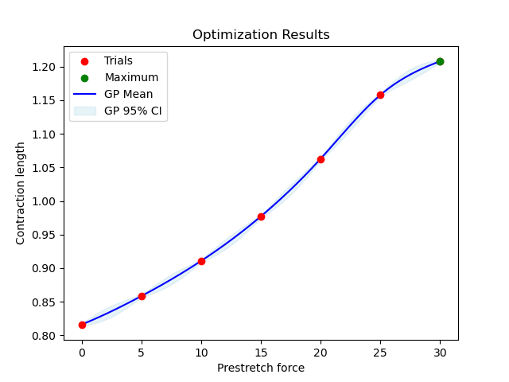

# Bayesian Optimization

## Description
Bayesian Optimization is a method to find maxima of blackbox functions with a relatively low number of function evaluations. This repository contains files for Bayesian Optimization that can be used by itself or be connected to OpenDiHu (https://github.com/opendihu/opendihu) to use a simulation as a function evaluation. 

## Dependencies
Python: Python 3.10.12

Required Python libraries: botorch, torch, numpy, matplotlib, subprocess, sys, os, shlex, csv, time, signal

OpenDiHu (if used): Version 1.5 (https://github.com/opendihu/opendihu/tree/v1.5)

## Setup
Inside "BayesianOptimization" are two setups for Bayesian Optimization that are both set up to optimize an easy dummy function. Inside "1D" is the setup for a one-dimensional function, inside "nD" the setup for a function from R^n to R.

Inside "opendihu_examples" are two categories: "isotonic_contraction" and "isometric_contraction". 

In "isotonic_contraction" we take a muscle and simulate its contraction after activation. With this simulation we can use Bayesian Optimization to look for the prestretch force that maximizes the muscle's contraction length. 

In "isometric_contraction" we take a muscle and simulate its behaviour and the generated forces with the muscle being activated, but fixed in place on both ends. With this simulation we can use Bayesian Optimization to look for the prestretch that maximizes its contraction force. 

Inside "BayesOpt_examples" is the example "test_functions" which can be used to test different Bayesian Optimization models on several test functions. These functions have different characteristics, so that you can choose a model that works best for the kind of functions you are looking for.

More details can be found in the corresponding ReadMe files.

## Results
This repository has started as a Bachelor Thesis (https://github.com/opendihu/optimization/tree/Bachelor-thesis). The following two sections are results from this thesis.

### The optimal Bayesian Optimization model over all test functions
This is the test_functions example. The word "optimal" is very subjective. In this case we are looking for a model that balances high accuracy with a low number of evaluations. Comparing all optional models averaged over all test functions, we find the following model as the best one:
- Kernel: Mátern kernel with smoothness parameter 0.5
- Mean: Constant mean
- Acquisition function: Entropy search

It takes on average 7.352 evaluations and finds local maxima in 85.2% and global maxima in 79.8% of cases. There are other models with a higher accuracy and models with a lower number of evaluations, but no model balaces it as well as this one does.
### The prestretch for the best range of motion of a cuboid muscle
This is the cuboid_muscle example. For a muscle to contract better, the idea is to stretch it before the contraction. This creates a function that maps a prestretch force to the length the muscle can contract in a certain amount of time with the given prestretch. The following plot shows the result of this model. As you can see, the function is almost linear, so that the best prestretch force in this scenario would be the maximal force with which the muscle does not tear.

