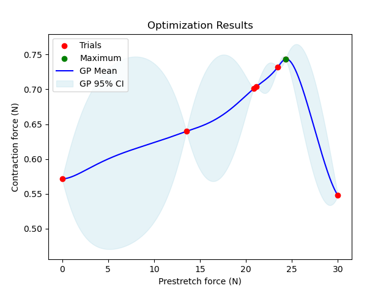

# Bayesian Optimization for a cuboid muscle model

## Setup
- A dummy cuboid muscle geometry. 
- The solvers for both stretching and contraction are coupled mechanics solver and fastmonodomain solver. In the prestretch process we set dynamic to `False` and add boundary conditions that simulate the muscle being fixed at one side and being pulled at from the other side. In the contraction process we set dynamic to `True` and fix both ends of the muscle in place by boundary conditions. 
- It uses the electrophysiology CellML model "hodgkin_huxley-razumova" and the incompressible mechanics model "Mooney-Rivlin".
- No preCICE involved. 

## How to run
To run a single simulation of stretching and contracting a muscle, go to build_release and run:
```
./muscle_contraction_with_prestretch ../settings_contraction_with_prestretch.py incompressible_mooney_rivlin 10.0
```

## Optimization
To run an optimization process, choose the optimization model, modify the parameters inside "setup_BayesOpt_cuboid_muscle.py" and run
```
python BayesOpt_cuboid_muscle.py
```
With this case we can use Bayesian Optimization to optimize the contraction force. This contraction force in a single time step is the average traction in the direction of the fibers at the left end of the muscle. Our function f: R -> R maps a prestretch force to the maximal contraction force of a muscle, that has been stretched with the prestretch force before contracting. One function evaluation is one simulation of the muscle. This way the optimization process outputs the prestretch force that leads to the greatest contraction force of our given muscle. Using the Matern kernel with nu=0.5, the constant mean function and the entropy search acquisition function, the plot of the optimization process looks like the following:



This muscle has a starting length of 12cm with 100 fibers and 100 sarcomeres each. The muscle's contraction force is the greatest if it has been stretched with about 24.3N before the contraction process and rapidly decreases with larger prestretch forces. 