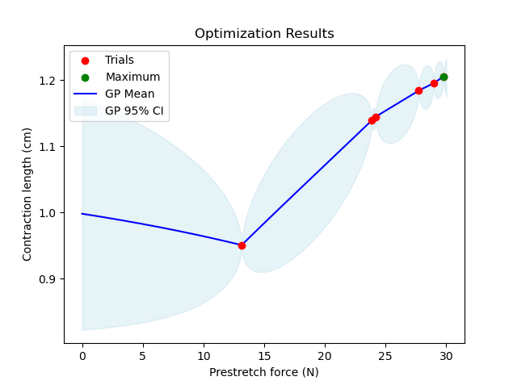
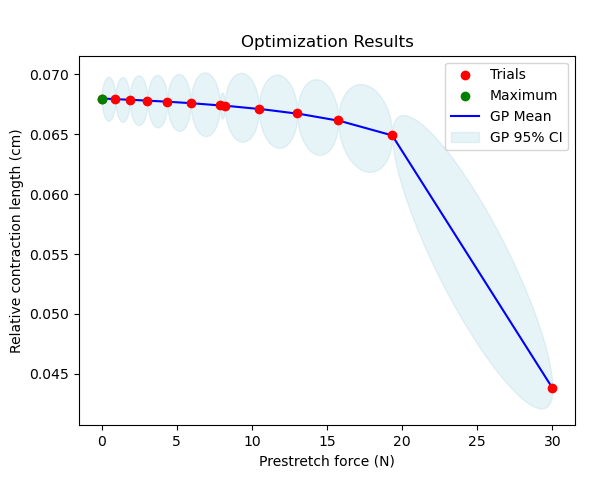

# Bayesian Optimization for a cuboid muscle model

## Setup
- A dummy cuboid muscle geometry. 
- The solvers for both stretching and contraction are coupled mechanics solver and fastmonodomain solver. In the prestretch process we set dynamic to `False` and add boundary conditions that simulate the muscle being fixed at one side and being pulled at from the other side. In the contraction process we set dynamic to `True` and let one end of the muscle free. 
- It uses the electrophysiology CellML model "hodgkin_huxley-razumova" and the incompressible mechanics model "Mooney-Rivlin".
- No preCICE involved. 
- With Bayesian Optimization we are looking for the prestretch force that yields the largest contraction length of the muscle

## How to run
To run a single simulation of stretching and contracting a muscle, go to build_release and run:
```
./muscle_contraction_with_prestretch ../settings_contraction_with_prestretch.py incompressible_mooney_rivlin 10.0
```

## Optimization
To run an optimization process, choose the optimization model, modify the parameters inside "setup_BayesOpt_cuboid_muscle.py" and run
```
python BayesOpt_cuboid_muscle.py
```
This will find the prestretch force that results in the greatest contraction length of the muscle. We optimize the function f:R->R that maps a prestretch force to the length the muscle can contract in a certain amount of time with the given prestretch. Using the Matern kernel with nu=0.5, the constant mean function and the entropy search acquisition function, the plot of the optimization process looks like the following:



This muscle has a starting length of 12cm with 100 fibers and 100 sarcomeres each. As we can see, the muscle can contract more in 40ms (this is the length of the simulation) if it has been stretched more before the contraction process. 



This is the same muscle as before, but now we are looking at the relativ contraction length (contraction length relative to its starting length). Here we see that the maximal relative contraction length is being attained at 0.