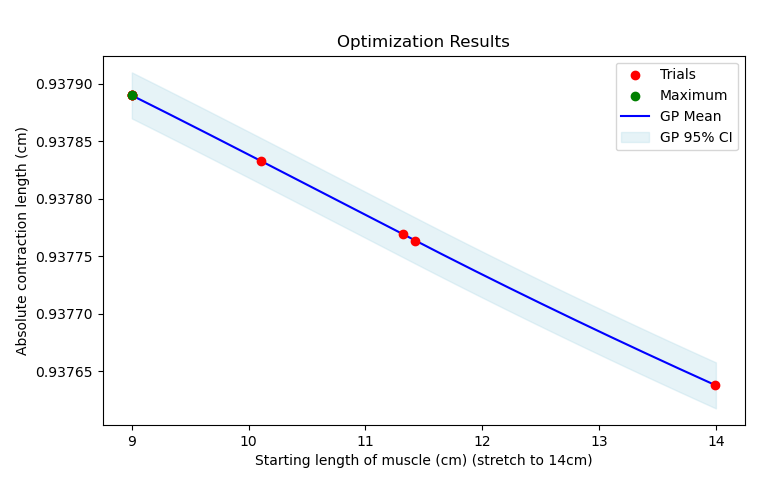
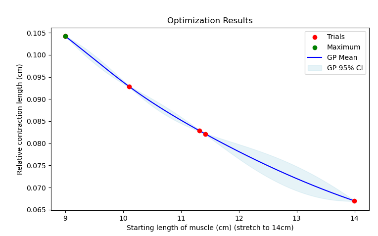

# Bayesian Optimization for a cuboid muscle model

## Setup
- A dummy cuboid muscle geometry. 
- The solvers for both stretching and contraction are coupled mechanics solver and fastmonodomain solver. In the prestretch process we set dynamic to `False` and add boundary conditions that simulate the muscle being fixed at one side and being pulled at from the other side until it has reached a given length. In the contraction process we set dynamic to `True` and let one end of the muscle free.
- It uses the electrophysiology CellML model "hodgkin_huxley-razumova" and the incompressible mechanics model "Mooney-Rivlin".
- No preCICE involved. 

## How to run
To run a single simulation of stretching and contracting a muscle, go to build_release and run:
```
./muscle_contraction_with_prestretch ../settings_contraction_with_prestretch.py --stress-free 12.0 --after-prestretch 14.0
```
where 12.0 is the length of the muscle before prestretch and 14.0 the length after prestretch.

## Optimization
To run an optimization process, choose the optimization model, modify the parameters inside "setup_BayesOpt_cuboid_muscle.py" and run
```
python BayesOpt_cuboid_muscle.py
```
With this case we can use Bayesian Optimization to optimize both the contraction length (length of the muscle before contraction process - length of the muscle after contraction process) and the relative contraction length (contraction length/length before prestretch). Our function f: $\mathbb{R}$ -> $\mathbb{R}$ maps a starting length of the muscle to the (relative) contraction length of a muscle, that has been stretched until it has reached the given prestretch length before contracting (which is the same for all starting lengths). One function evaluation is one simulation of the muscle. This way the optimization process outputs the prestretch length that leads to the greatest contraction length of our given muscle. Using the Matern kernel with nu=0.5, the constant mean function and the entropy search acquisition function, the plots of the optimization processes look like the following:




These muscles have 100 fibers and 100 sarcomeres each. As we can see, the muscle can contract more in 40ms (this is the length of the simulation) if its starting length was shorter and it has been stretched further.