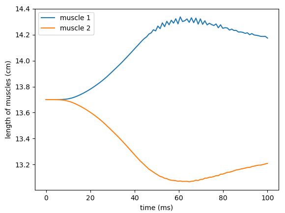

# Bayesian Optimization for two coupled cuboid muscles

## Setup
- Two ellipsoid muscle geometries. The 3d geometries are created in ```ellipsoid_mesh_generation.py```, and the fibers' geometries are given by ```mesh_left.json``` and ```mesh_right.json```.
- The solvers for the contraction are coupled mechanics solver and fastmonodomain solver. In the contraction process we set dynamic to `True`, fix the outer end of the muscles and apply a Neumann boundary condition at the inner end of the muscles. The force in the Neumann boundary condition is updated at every timestep and it is different for each muscle. We compute the force such that it mimics the effect of an immaginary tendon connecting the two muscle. We assume the tendon behaves like a spring and compute the force using Hooke's law: $F_{tendon} = k_{tendon} (l − l_0 )$. The spring's constant is $10N/cm$ by default, but can be modified in ```variables/variables.py``` by changing ```tendon_spring_constant``` to the desired value.
- It uses the electrophysiology CellML model "hodgkin_huxley-razumova" and the incompressible mechanics model "Mooney-Rivlin".
- No preCICE involved. 

## How to run
To run a single simulation of contracting the muscles, go to build_release and run:
```
./contraction ../settings_contraction.py
```
To run a single simulation of prestretch with contraction of the muscles, go to build_release and run:
```
./contraction_with_prestretch ../settings_contraction_with_prestretch.py incompressible_mooney_rivlin 10.0 5.0
```
The first of the two force parameters `10` is the prestretch force for the first muscle, the second one `5` is for the second muscle. If only one force parameter is given, both muscles use the same prestretch force. If no force parameter is given, both muscles use the prestretch force `10`.

## Results
To answer the question how coupled ellipsoid muscles behave we have a few results.

The first plot shows the difference between a single muscle and a coupled muscle: 


The solid orange line is the length over time of an ellipsoid muscle that contracts while being connected to another ellipsoid muscle via a spring with constant $k=500$. The dashed orange line is the length over time of a single ellipsoid without connections to other muscles. As we can see, the connection dampens the muscle's bouncing effect after the completed contraction. Also, the connected muscle does not contract as much as the single one does.

If we now look at two connected ellipsoid muscles with a spring constant $k=500$, we get the following plot for the lengths over time of the connected muscles:



The orange line here is the same as the solid orange line in the plot before. The blue line here is the coupled muscle that is not being activated and only stretched by muscle 2. The small oscillations starting at $t=50$ms are unphysical. Reducing the timestep does not eliminate the oscillations.

If we now look at two coupled muscles with the smaller constant $k=10$, we get the following plot:


We do not get these oscillations as before, but with a small constant the muscles bounce much more after the contraction than with a larger constant. We can also see that the muscle can contract much more in comparison to the case in the plot before.